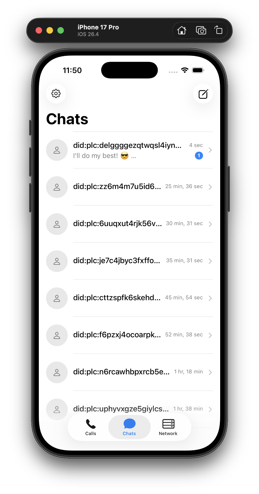
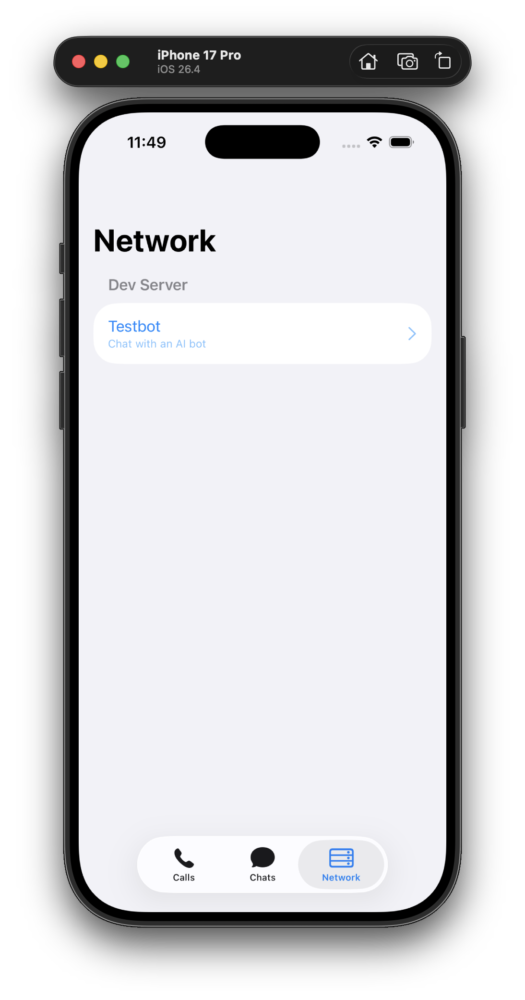
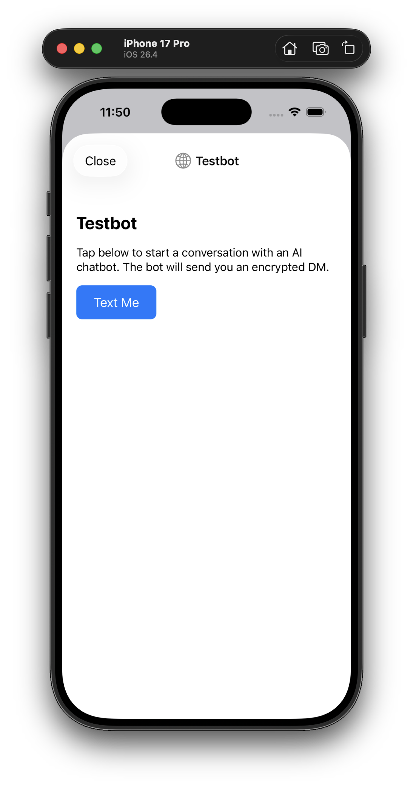

# Avalanche

The online+offline social network. We help people organize.

Anyone can build a social network these days, but who will use it? Our answer is that we'll build great tools for organizing, and people will install the app because a specific action they're participating in (a rescue, a canvass, etc) requires it. They'll stick around because the network captures and represents the real social connections they formed.

The design centers on Signal-quality encrypted messaging — a unified inbox of all your conversations across all your activism — with a platform for rapidly-built, well-integrated organizing tools: team assignment, action-day maps, Q&A bots, collaborative documents, and more.

<p align="center">
  
  
  
</p>

## Getting started

If you want to develop iOS, you'll need a Mac; but should be able to do everything else on any platform.

### Install prerequisites (Mac specific)

- [OrbStack](https://orbstack.dev/) (our recommended Docker server, but plain old Docker is ok too)
- [Rust](https://rustup.rs/) (stable)
- Node 26+ (via `fnm` or `nvm`, with Temporal pre-installed)[^nodev]
- [Xcode](https://developer.apple.com/xcode/) 16+
- Homebrew, to install dev tools used by our build commands: XcodeGen and qrencode — `brew install xcodegen qrencode fnm`
- [Android Studio](https://developer.android.com/studio) — it bundles the SDK
  Manager, a JDK, and an emulator.
- Use Android Studio's **SDK Manager** to install:
  - **SDK Platforms** tab → the latest stable Android SDK platform.
  - **SDK Tools** tab → **NDK (Side by side)**. (Also you'll want to ensure
    Build Tools, Platform Tools and an emulator are installed.)
- Rust Android targets: `rustup target add aarch64-linux-android x86_64-linux-android`
- [cargo-ndk](https://github.com/bbqsrc/cargo-ndk): `cargo install cargo-ndk`
- [Tailscale](https://tailscale.com/) (recommended)

[^nodev]: The build requires Node 26+ *with Temporal*. This version is quite new as of this writing, and for some reason Homebrew's packaging does not include Temporal even though it is included by default for most Node 26 builds. You can install it via a Node version manager like fnm. You can check if it's installed by typing: `node -e "console.log(typeof Temporal)"` and seeing whether you get `object` (yes) or `undefined` (no).


### Install prerequisites (other platforms)

- A Docker server of your choice
- [Rust](https://rustup.rs/) (stable)
- Node 26+ with Temporal[^nodev]
- [Android Studio](https://developer.android.com/studio)
- Dev tools used by our build commands: qrencode (install with your package manager)
- Use Android Studio's **SDK Manager** to install:
  - **SDK Platforms** tab → the latest stable Android SDK platform.
  - **SDK Tools** tab → **NDK (Side by side)**. (Also you'll want to ensure
    Build Tools, Platform Tools and an emulator are installed.)
- Rust Android targets: `rustup target add aarch64-linux-android x86_64-linux-android`
- [cargo-ndk](https://github.com/bbqsrc/cargo-ndk): `cargo install cargo-ndk`
- [Tailscale](https://tailscale.com/) (recommended)

### Set up your local environment

We highly recommend setting up and enabling Tailscale on your laptop and any devices you intend to test with.[^tailscale]

[^tailscale]: We use Tailscale to make it so you don't need to mess around with `localhost` vs other IP addresses on your local network, nor do you need to make sure your phone and laptop are on the same wifi -- your Tailscale laptop URL is stable and reachable cross-network. If you prefer to skip tailscale and use localhost, that works too.

In your `.env` (copy `.env.example` first if you haven't), set:

* SERVER_URL to your Tailscale url for your laptop `http://<host>.tail<NNNNN>.ts.net:3000`
* ANTHROPIC_API_KEY (optional) if you have a Claude account and want testbot to respond with AI. (This costs pennies to run and is nice to have to make your demos feel real!)

### Run the backend

```bash
make dev-all   # starts all services locally + launches homeserver + relay + testbot
```

This uses Docker to install a few dev prereqs including a Postgres database server, then runs the homeserver on port 3000, and builds and launches some Node-based default projects (testbot and adminbot) that connect to it.

### Run the desktop app (Windows / macOS / Linux)

See **[desktop/README.md](desktop/README.md)** for prerequisites and setup instructions. Short version:

```bash
cd desktop
npm install
npm run tauri dev
```

No server needed — the desktop app runs in mock mode by default.

### Run the iOS app on simulator

```bash
make ios       # build Rust → XCFramework, generate Swift bindings, generate Xcode project
```

Then open `mobile/ios/Actnet/Actnet.xcodeproj` in Xcode, select an iPhone simulator or device, and run.

If you're running on a real device[^appledev], plug your device in and enable developer mode: **Settings → Privacy & Security → Developer Mode** and trust the laptop when prompted. First-time device prep takes a few minutes.

[^appledev]: Note: I think Apple requires a paid developer account to run on real devices.

### Run the Android app

```bash
make android   # cross-compile Rust core → libapp_core.so per ABI,
               # generate Kotlin bindings, then build the debug APK
```

Then open `mobile/android` in Android Studio, trigger Gradle to sync, then pick an emulator or device, and run.

If you're running on a real device, enable developer mode (**Settings → About phone → tap Build number seven times**), turn on **USB debugging** under Developer options, plug in, and trust the laptop when prompted.

### Create your first account

To create your first account, type `make dev-invite` and then use the running app to paste or scan the invite token.

## Docs

There's a wealth of documentation to keep reading. Start with [00 — Design](docs/00-design.md) — goals, architecture, threat model, and Projects.
